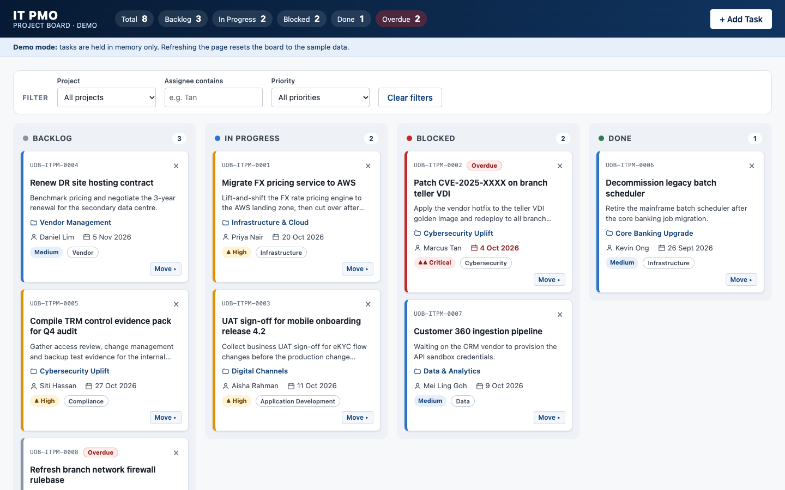

# IT PMO Project Board (Demo)

[](https://github.com/arulnavneet-rgb/ClaudeDemo/actions/workflows/pages.yml)

A Kanban board for tracking IT project management office (PMO) tasks at a fictitious bank. It's a demo and training app: it isn't an official system of any real bank, and all tasks, projects and people in it are sample data.

**Live demo:** https://arulnavneet-rgb.github.io/ClaudeDemo/

**Redesign (v2):** https://arulnavneet-rgb.github.io/ClaudeDemo/v2/ has the same board with a new look and a due-date strip in the header that plots every open task against today. Its source is [`v2/index.html`](v2/index.html).



## Features

- **Four columns:** Backlog, In Progress, Blocked and Done, each with a live task count.
- **Header summary:** totals per status, plus a count of overdue tasks.
- **Add Task form** with inline validation. Fields: title, description (max 500 characters), project, category, assignee, priority, status and due date. New tasks get IDs like `UOB-ITPM-0001`.
- **Move tasks** by drag and drop, or with the keyboard-friendly "Move ▸" menu on each card.
- **Delete tasks** with an inline "Delete? Yes / No" confirmation.
- **Filters** by project, assignee and priority, with a "Clear filters" button.
- **Overdue highlighting:** tasks past their due date are badged. The sample data uses dates relative to today, so some tasks are always overdue.
- **Priority** (Critical, High, Medium, Low) is shown by a coloured border, a text label and a ▲/▼ symbol, so colour is never the only signal.
- **Email notification** for each new task, sent through [FormSubmit](https://formsubmit.co/) (optional, see below).
- **Accessible:** labelled controls, focus kept after updates, Escape closes menus and the panel, screen-reader announcements for toasts and filter results.
- **Responsive:** the columns stack below 768px wide, and the Add Task panel moves above the board below 1100px.

## Running it

Download `index.html` and double-click it. It runs straight from your computer with no server, install or internet connection needed.

To test email notifications locally, serve the folder over http, because FormSubmit may reject requests from `file://` pages:

```sh
python3 -m http.server
# then open http://localhost:8000
```

## No saved data

Tasks are held in memory only. **Refreshing the page resets the board to the sample data.** This is deliberate, and the app shows a "Demo mode" note saying so. It doesn't use cookies, localStorage or any other browser storage.

## Configuring email notifications

The notification address is set in one place, the first constant in the `<script>` block of `index.html`:

```js
const FORMSUBMIT_ENDPOINT = "https://formsubmit.co/ajax/YOUR_EMAIL@example.com";
```

- While it still contains `YOUR_EMAIL`, no email is sent. Adding a task still works, and a warning toast says the notification failed.
- FormSubmit needs a one-time activation. The first submission to a new address sends a confirmation email instead of the notification. Notifications are delivered after someone clicks the link in that email.
- Emails arrive with the subject `[UOB IT PMO] New task <id>: <title>`.
- A failed or slow notification never breaks the board. The new task stays on it either way.

> **Note:** the address you put here is visible to anyone who views the page source on the public site.

## Tech

- Vanilla HTML, CSS and JavaScript in a single file, `index.html`.
- No frameworks, libraries, build step or npm packages.
- No external resources: system fonts, inline SVG and Unicode icons only.
- The only network request is the optional FormSubmit call.

## Deployment

[`.github/workflows/pages.yml`](.github/workflows/pages.yml) publishes `index.html` to the site root and `v2/index.html` to `/v2/` (only those two files) on every push to `main`. You can also run it by hand from the Actions tab.

One-time setup: in the repo, go to **Settings → Pages** and set **Source** to **GitHub Actions**.

Deploy runs are listed at https://github.com/arulnavneet-rgb/ClaudeDemo/actions.
